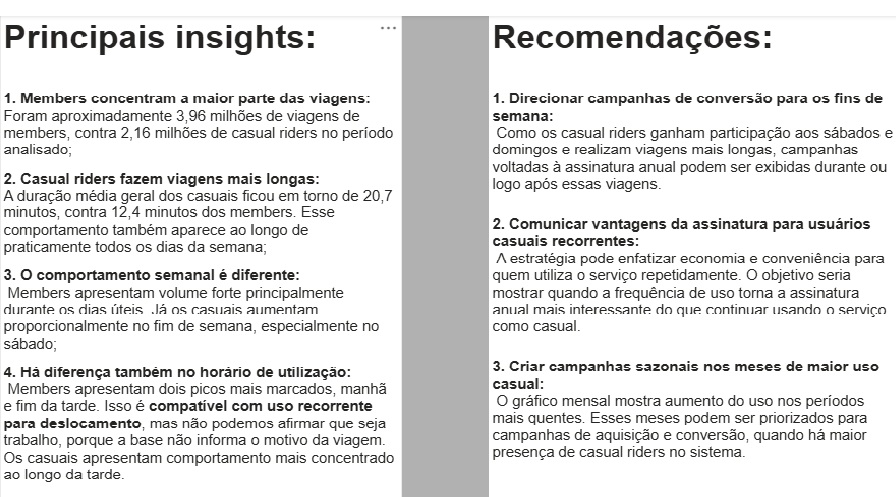

# Cyclistic Bike-Share Analysis

Estudo de caso desenvolvido como parte do **Google Data Analytics Professional Certificate**, oferecido pelo Google na Coursera.

O projeto simula uma situação real de trabalho de uma analista de dados júnior e segue as etapas propostas pelo curso: **Perguntar, Preparar, Processar, Analisar, Compartilhar e Agir**.

## Sobre o curso

- [Google Data Analytics Professional Certificate](https://www.coursera.org/professional-certificates/google-data-analytics)
- [Google Data Analytics Capstone: Complete a Case Study](https://www.coursera.org/learn/google-data-analytics-capstone)

---

## Contexto do estudo de caso

A **Cyclistic** é uma empresa fictícia de compartilhamento de bicicletas em Chicago.

No cenário proposto pelo Google, a diretora de marketing acredita que o crescimento futuro da empresa depende do aumento do número de **assinaturas anuais**. Para apoiar essa estratégia, a equipe de análise precisa compreender como dois grupos utilizam o serviço:

- **member**: usuários com assinatura anual;
- **casual**: usuários que utilizam passes avulsos ou diários.

O estudo de caso apresenta três perguntas de negócio:

1. Como os assinantes anuais e os usuários casuais utilizam as bicicletas da Cyclistic de maneiras diferentes?
2. Por que os usuários casuais comprariam assinaturas anuais?
3. Como a Cyclistic pode usar mídias digitais para influenciar usuários casuais a se tornarem assinantes?

Neste projeto, a pergunta atribuída à análise foi:

> **Como os assinantes anuais e os usuários casuais utilizam as bicicletas da Cyclistic de maneiras diferentes?**

O objetivo foi identificar diferenças de comportamento entre os dois grupos e transformar os achados em recomendações capazes de apoiar futuras estratégias de conversão de usuários casuais em assinantes anuais.

---

## Resumo das instruções do case

O material do Google orienta o desenvolvimento do estudo em seis etapas:

### 1. Perguntar
Definir o problema de negócio, identificar as partes interessadas e estabelecer claramente a pergunta que deverá ser respondida.

### 2. Preparar
Obter os dados históricos de viagens, compreender sua estrutura e avaliar integridade, credibilidade, privacidade, licenciamento e limitações.

### 3. Processar
Verificar erros e inconsistências, escolher as ferramentas de trabalho, limpar e transformar os dados e documentar as alterações realizadas.

### 4. Analisar
Organizar os dados, realizar cálculos, criar estatísticas descritivas e identificar tendências e relações relevantes para a pergunta de negócio.

### 5. Compartilhar
Criar visualizações claras e profissionais que comuniquem os principais achados para um público executivo.

### 6. Agir
Transformar os resultados da análise em **três recomendações de negócio baseadas nos dados**.

---

## Dados utilizados

Os dados são registros públicos de viagens da **Divvy**, utilizados pelo estudo de caso para representar a empresa fictícia Cyclistic.

Foram analisados **12 arquivos mensais**, correspondentes ao período de **setembro de 2025 a agosto de 2026**.

### Arquivos e fontes

| Recurso | Link |
|---|---|
| Dados originais Divvy | https://divvy-tripdata.s3.amazonaws.com/index.html |
| Instruções do estudo de caso | https://drive.google.com/file/d/1u_7951LuTewBW-5TVi7LggP8d_GWFzyb/view?usp=sharing |
| Base tratada `cyclistic_limpo.csv` | https://drive.google.com/file/d/13gkQdLmNL2fyKYKT0Ty7U5z3SaLbyza_/view?usp=sharing |
| Projeto Power BI | https://drive.google.com/file/d/1Ddb5DukxWc_TXkhesHI3NAJtzMzuP6BL/view?usp=sharing |

Os arquivos maiores foram disponibilizados externamente por causa do tamanho, mantendo o repositório leve e fácil de navegar.

---

## Estrutura da base original

Os arquivos mensais continham as seguintes colunas:

| Coluna | Descrição |
|---|---|
| `ride_id` | Identificador único da viagem |
| `rideable_type` | Tipo de bicicleta |
| `started_at` | Data e horário de início |
| `ended_at` | Data e horário de término |
| `start_station_name` | Nome da estação inicial |
| `start_station_id` | ID da estação inicial |
| `end_station_name` | Nome da estação final |
| `end_station_id` | ID da estação final |
| `start_lat` | Latitude inicial |
| `start_lng` | Longitude inicial |
| `end_lat` | Latitude final |
| `end_lng` | Longitude final |
| `member_casual` | Categoria do usuário: `member` ou `casual` |

---

## Preparação e limpeza

Os 12 arquivos mensais foram consolidados em uma única base.

Durante a preparação dos dados foram realizadas verificações de:

- estrutura e tipos de dados;
- datas e horários de início e término;
- duplicidade de `ride_id`;
- valores ausentes;
- consistência da variável `member_casual`;
- duração das viagens.

Também foram criadas variáveis derivadas para apoiar a análise:

| Variável | Finalidade |
|---|---|
| `ride_length_min` | Duração da viagem em minutos |
| `day_of_week` | Dia da semana em que a viagem começou |
| `month` | Mês da viagem |
| `hour` | Hora de início da viagem |

A base final utilizada na análise ficou com aproximadamente **6,12 milhões de viagens**.

---

## Base preparada para o Power BI

Para a etapa de visualização foi criado um recorte da base, mantendo apenas as informações necessárias para responder à pergunta de negócio.

Foram retiradas do arquivo destinado ao Power BI as colunas relacionadas à localização e identificação das estações:

- `start_station_name`
- `start_station_id`
- `end_station_name`
- `end_station_id`
- `start_lat`
- `start_lng`
- `end_lat`
- `end_lng`

O campo `rideable_type` também não foi utilizado na análise final, pois o foco do estudo foi a comparação entre **usuários `member` e `casual`**, e não entre tipos de bicicleta.

Essa redução diminuiu o volume levado ao Power BI sem retirar as informações necessárias para a análise proposta.

---

## Dashboard

O dashboard foi desenvolvido no **Power BI** para comparar os padrões de uso entre assinantes e usuários casuais.


### Indicadores gerais

| Indicador | Resultado |
|---|---:|
| Total de viagens | **6,12 milhões** |
| Duração média geral | **15,31 min** |
| Duração mediana | **9,26 min** |
| Viagens de usuários `casual` | **2,16 milhões** |
| Viagens de usuários `member` | **3,96 milhões** |

O painel também compara os grupos por:

- dia da semana;
- mês;
- hora do dia;
- duração média das viagens.

---

## Principais insights

### 1. Assinantes concentram a maior parte das viagens

Os usuários `member` realizaram aproximadamente **3,96 milhões de viagens**, enquanto os usuários `casual` realizaram cerca de **2,16 milhões** no período analisado.

Isso mostra uma utilização mais frequente do serviço por parte dos assinantes.

### 2. Usuários casuais fazem viagens mais longas

A duração média das viagens dos usuários `casual` ficou em aproximadamente **20,7 minutos**, contra cerca de **12,4 minutos** entre os `member`.

Esse comportamento se mantém ao longo de praticamente todos os dias da semana.

### 3. O padrão semanal dos grupos é diferente

Os `member` apresentam volume elevado principalmente durante os dias úteis.

Já os usuários `casual` aumentam proporcionalmente sua participação no fim de semana, com destaque para o **sábado**.

### 4. Há diferenças também no horário de utilização

Os `member` apresentam dois picos mais marcados, um pela manhã e outro no fim da tarde.

Esse padrão é **compatível com um uso recorrente para deslocamento**, mas os dados disponíveis não permitem afirmar que a finalidade da viagem seja trabalho.

Os usuários `casual` apresentam comportamento mais concentrado ao longo da tarde.

---

## Insights e recomendações



---

## Recomendações de negócio

### 1. Direcionar campanhas de conversão para os fins de semana

Como os usuários `casual` ganham participação aos sábados e domingos e realizam viagens mais longas, campanhas voltadas à assinatura anual podem ser exibidas durante ou imediatamente após essas viagens.

### 2. Comunicar vantagens da assinatura para usuários casuais recorrentes

Campanhas podem enfatizar **economia e conveniência** para usuários que utilizam o serviço repetidamente.

A recomendação é identificar situações em que a frequência de uso torne a assinatura anual potencialmente mais interessante do que continuar utilizando o serviço de forma casual.

### 3. Criar campanhas sazonais nos meses de maior uso casual

A análise mensal mostra aumento do uso nos períodos mais quentes.

Esses meses podem ser priorizados para campanhas de aquisição e conversão, quando existe maior presença de usuários `casual` no sistema.

---

## Resposta à pergunta de negócio

A análise mostra que `member` e `casual` apresentam padrões distintos de utilização.

Os **assinantes**:

- representam a maior parcela das viagens;
- apresentam viagens médias mais curtas;
- mantêm volume elevado durante os dias úteis;
- apresentam picos mais definidos pela manhã e no final da tarde.

Os **usuários casuais**:

- realizam menos viagens no total;
- fazem viagens significativamente mais longas;
- aumentam sua participação relativa aos fins de semana;
- apresentam maior concentração de uso durante a tarde.

Essas diferenças permitem direcionar ações de marketing para momentos e perfis de uso em que a conversão para assinatura pode ser mais relevante.

---

## Ferramentas utilizadas

- **Python**
- **Pandas**
- **Jupyter Notebook / Google Colab**
- **Pentaho Data Integration**
- **Power BI**
- **Git / GitHub**

---

## Fluxo do projeto

```text
Dados públicos da Divvy
        ↓
12 arquivos CSV mensais
        ↓
Consolidação e validação
        ↓
Limpeza e criação de variáveis
        ↓
cyclistic_limpo.csv
        ↓
Recorte analítico
        ↓
Power BI
        ↓
Dashboard
        ↓
Insights e recomendações
```

---

## Objetivo de portfólio

Este projeto foi desenvolvido com finalidade acadêmica e de portfólio, aplicando conceitos estudados no **Google Data Analytics Professional Certificate** a uma base com mais de seis milhões de registros.

O projeto demonstra experiência prática em:

- compreensão de problemas de negócio;
- consolidação e preparação de grandes volumes de dados;
- limpeza e transformação;
- análise exploratória;
- criação de métricas;
- visualização de dados;
- construção de dashboards no Power BI;
- interpretação dos resultados;
- formulação de recomendações baseadas em dados.

---

## Referências

- [Google Data Analytics Professional Certificate](https://www.coursera.org/professional-certificates/google-data-analytics)
- [Google Data Analytics Capstone: Complete a Case Study](https://www.coursera.org/learn/google-data-analytics-capstone)
- [Dados públicos Divvy](https://divvy-tripdata.s3.amazonaws.com/index.html)
- [Instruções do estudo de caso](https://drive.google.com/file/d/1u_7951LuTewBW-5TVi7LggP8d_GWFzyb/view?usp=sharing)
- [Base tratada completa](https://drive.google.com/file/d/13gkQdLmNL2fyKYKT0Ty7U5z3SaLbyza_/view?usp=sharing)
- [Projeto Power BI](https://drive.google.com/file/d/1Ddb5DukxWc_TXkhesHI3NAJtzMzuP6BL/view?usp=sharing)

https://drive.google.com/file/d/1Ddb5DukxWc_TXkhesHI3NAJtzMzuP6BL/view?usp=sharing
